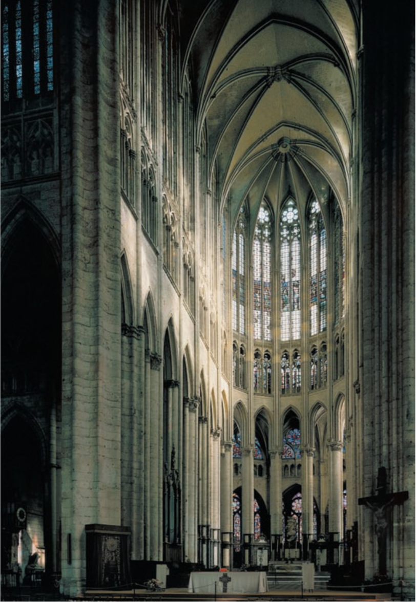
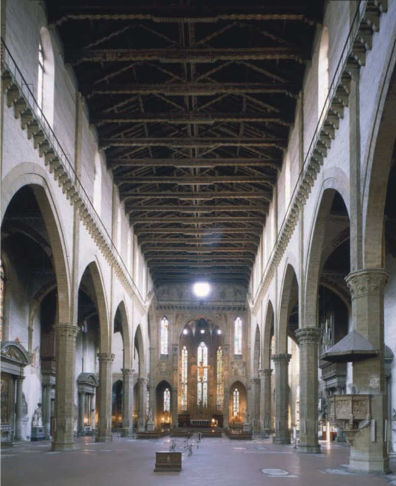

## Art through the Ages Notebook

Note Author: RobinXYuan

### INTRODUCTION: WHAT IS ART HISTORY?

- **Central aim of Art History**
  A central aim of art history is to determine the original context of artworks.

- **Art historians' target**
  Art historians seek to achieve a full understanding not only of why these “persisting events” of human history look the way they do but also of why the artistic events happened at all.

- **Relationship between Art History and History**
  The study of history is therefore vital to art history. And art history is often very important to the study of history.

#### ART HISTORY IN THE 21ST CENTURY

- **Classification**
  Scholars traditionally have classified such works as **architecture**, **sculpture**, the **pictorial arts** (painting, drawing, printmaking,and photography),and the **craft arts**,or arts of design. 
  The craft arts comprise utilitarian objects, such as *ceramics*, *metal- work*,*textiles*,*jewelry*,and *similar accessories of ordinary living*. Artists of every age have blurred the boundaries among these categories, but this is especially true today,when multimedia works abound.

##### THE QUESTIONS ART HISTORIANS ASK

1. HOW OLD IS IT?

- CHRONOLOGY
  An indispensable subject of art historical inquiry is chronology,the dating of art objects and buildings. 
- PHYSICAL EVIDENCE
  Physical evidence often **reliably indicates an object’s age**. 
- DOCUMENTARY EVIDENCE
  Documentary evidence can help pinpoint the date of an object or building when a dated written document mentions the work.
- INTERNAL EVIDENCE
  Internal evidence can play a significant role in dating an art- work. A painter might have depicted an identifiable person or a kind of hairstyle,clothing,or furniture fashionable only at a certain time.
- STYLISTIC EVIDENCE
  Stylistic evidence is also very important.The analysis of style—an artist’s distinctive manner of producing an object—is the art histo- rian’s special sphere. Unfortunately, because it is a subjective assess- ment,**stylistic evidence is by far the most unreliable chronological criterion**.

2. WHAT IS ITS STYLE

- PERIOD STYLE
  Period style refers to **the characteristic artistic manner of a spe- cific time**, **usually within a distinct culture**, such as “Archaic Greek”or “Late Byzantine.”
- REGIONAL STYLE
  Regional style is the term art historians use to describe variations in style tied to geography. Like an object’s date, its provenance, or place of origin, can significantly determine its character.Very of- ten two artworks from the same place made centuries apart are more similar than contemporaneous works from two different regions.
  
  
- PERSONAL STYLE
  Personal style, the distinctive manner of individual artists or ar- chitects,often decisively explains stylistic discrepancies among mon- uments of the same time and place. 
  
  
